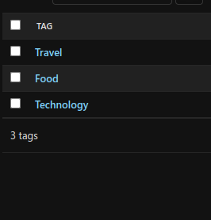
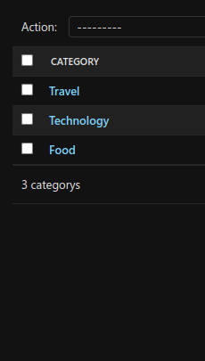
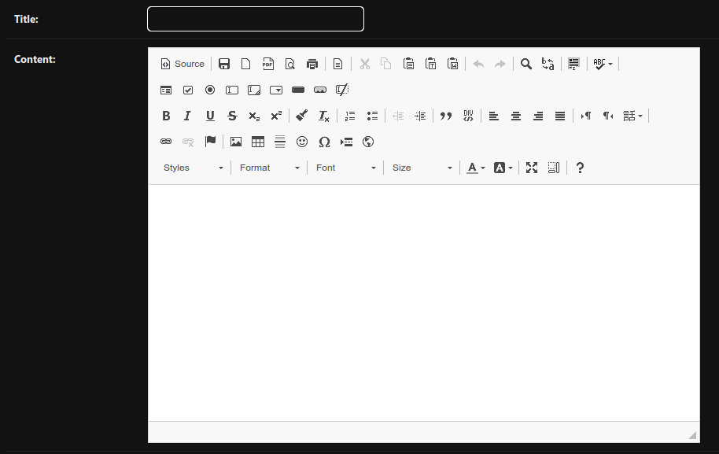
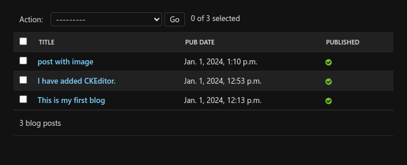

# Project-Blog

This will be my personal Blog, and you can use it(ig).

Till not decided will i be keeping my domain name or blog name, I only decided it's gonna be <b>IAmHeroForFun</b>, but will it related to my contact?. I am thinking like i will make seperate tags like, personal life, Tech, Adventure, Etc.

### TOOLS i use
- Python Django Framework(Web back-end Framework)
- MongoDB (NoSql Database)
- Bootstraps 5 (front-end)
- VSCode/Neovim (IDE)

### Todo
- [x] **Plan** Wil be updated as i learn and make.
- [ ] **Front-end** I will be using bootstraps. So my foal is to keep it simple yet responsive on all devices. 
- [x] **Model** This part is very important, So i will be applying as i Learn.
    - [x] **Post** 
    - [x] **Tags**
- [ ] **View & URLS** Once model is setup well, I am pretty sure getting it into front-end from here filtering content and many more stuffs from here will get easier. Might change as i improve my skillz.
- [ ] **DATABASE** I decided to go with MongoDB because i will be making changes to tables and stuffs and according to my current knowledge mongoDB should do.
- [ ] **WORK ON DEPLOYMENT** This part will be updated depending on where i am gonna host i will learn lot of database, web server, hosting, domain, etc.

### Samples so far (I will be changing as i do changes.)

 
Tags page sample

 
Category page sample

 
CKeditor page sample

 

### You want to clone the project and try? 
JUST
`git clone https://github.com/IAmHeroForFun/heros-blog.git`
THEN
`pip install -r requirements.txt`
AND START.

THANK YOU FOR STICKING WITH ME, HOPE YOU CAN GUIDE ME.
=======================================================
